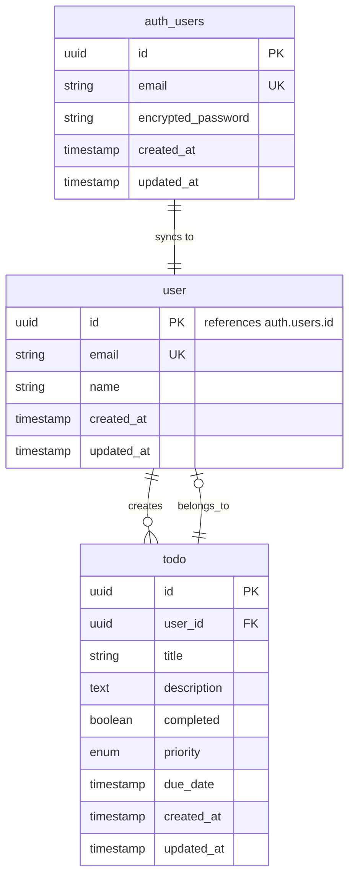

# Database Schema

## Overview

This document describes the database schema for the Todo application. The database uses PostgreSQL with UUID primary keys and follows a multi-tenant architecture where each user has isolated access to their own todos.

**Authentication**: This application uses Supabase Auth for user authentication. The `auth.users` table (managed by Supabase) handles authentication, while the `public.user` table stores additional user profile information.

## Database Technology

- **Database**: PostgreSQL (via Supabase)
- **Authentication**: Supabase Auth (`auth.users` table)
- **Primary Keys**: UUID (v4)
- **Naming Convention**: Singular table names (e.g., `user`, `todo`)
- **Multi-Tenant**: Row-level security based on user isolation

## Entity Relationship Diagram



## Tables

### user

Stores user profile information synced from Supabase Auth. Authentication is handled by Supabase's `auth.users` table.

| Column | Type | Constraints | Description |
|--------|------|-------------|-------------|
| `id` | `uuid` | PRIMARY KEY, REFERENCES `auth.users(id)` | User identifier (matches Supabase Auth user ID) |
| `email` | `varchar(255)` | UNIQUE, NOT NULL | User email address (synced from `auth.users`) |
| `name` | `varchar(255)` | NULL | User's display name (defaults to email prefix if not provided) |
| `created_at` | `timestamptz` | NOT NULL, DEFAULT `now()` | Profile creation timestamp |
| `updated_at` | `timestamptz` | NOT NULL, DEFAULT `now()` | Last update timestamp |

**Indexes:**
- `idx_user_email` on `email` (unique)

**Triggers:**
- `update_updated_at` - Automatically updates `updated_at` on row modification
- `handle_new_user` - Automatically creates user profile when new user signs up in Supabase Auth

**Note**: The `id` field references `auth.users.id` from Supabase Auth. When a user registers, a trigger automatically creates a corresponding record in this table.

### todo

Stores todo items with multi-tenant isolation via `user_id` foreign key.

| Column | Type | Constraints | Description |
|--------|------|-------------|-------------|
| `id` | `uuid` | PRIMARY KEY, DEFAULT `gen_random_uuid()` | Unique identifier |
| `user_id` | `uuid` | FOREIGN KEY, NOT NULL | Owner of the todo (references `user.id`) |
| `title` | `varchar(255)` | NOT NULL | Todo title |
| `description` | `text` | NULL | Optional description |
| `completed` | `boolean` | NOT NULL, DEFAULT `false` | Completion status |
| `priority` | `enum` | NULL | Priority level: `low`, `medium`, `high` |
| `due_date` | `timestamptz` | NULL | Optional due date |
| `created_at` | `timestamptz` | NOT NULL, DEFAULT `now()` | Creation timestamp |
| `updated_at` | `timestamptz` | NOT NULL, DEFAULT `now()` | Last update timestamp |

**Indexes:**
- `idx_todo_user_id` on `user_id` (for efficient user-based queries)
- `idx_todo_completed` on `completed` (for filtering completed todos)
- `idx_todo_due_date` on `due_date` (for sorting and filtering by due date)
- `idx_todo_priority` on `priority` (for filtering by priority)

**Foreign Keys:**
- `fk_todo_user` - `user_id` REFERENCES `user(id)` ON DELETE CASCADE

**Triggers:**
- `update_updated_at` - Automatically updates `updated_at` on row modification

## SQL Schema

### Create Enum Type

```sql
CREATE TYPE priority_level AS ENUM ('low', 'medium', 'high');
```

### Create Tables

```sql
-- User table (profile information synced from Supabase Auth)
CREATE TABLE "user" (
    id UUID PRIMARY KEY REFERENCES auth.users(id) ON DELETE CASCADE,
    email VARCHAR(255) NOT NULL UNIQUE,
    name VARCHAR(255),
    created_at TIMESTAMPTZ NOT NULL DEFAULT now(),
    updated_at TIMESTAMPTZ NOT NULL DEFAULT now()
);

-- Todo table
CREATE TABLE todo (
    id UUID PRIMARY KEY DEFAULT gen_random_uuid(),
    user_id UUID NOT NULL REFERENCES "user"(id) ON DELETE CASCADE,
    title VARCHAR(255) NOT NULL,
    description TEXT,
    completed BOOLEAN NOT NULL DEFAULT false,
    priority priority_level,
    due_date TIMESTAMPTZ,
    created_at TIMESTAMPTZ NOT NULL DEFAULT now(),
    updated_at TIMESTAMPTZ NOT NULL DEFAULT now()
);
```

### Create Indexes

```sql
-- User indexes
CREATE INDEX idx_user_email ON "user"(email);

-- Todo indexes
CREATE INDEX idx_todo_user_id ON todo(user_id);
CREATE INDEX idx_todo_completed ON todo(completed);
CREATE INDEX idx_todo_due_date ON todo(due_date);
CREATE INDEX idx_todo_priority ON todo(priority);

-- Composite index for common queries
CREATE INDEX idx_todo_user_completed ON todo(user_id, completed);
CREATE INDEX idx_todo_user_due_date ON todo(user_id, due_date) WHERE due_date IS NOT NULL;
```

### Create Triggers

```sql
-- Function to update updated_at timestamp
CREATE OR REPLACE FUNCTION update_updated_at_column()
RETURNS TRIGGER AS $$
BEGIN
    NEW.updated_at = now();
    RETURN NEW;
END;
$$ LANGUAGE plpgsql;

-- Function to handle new user creation from Supabase Auth
CREATE OR REPLACE FUNCTION handle_new_user()
RETURNS TRIGGER AS $$
DECLARE
    user_name VARCHAR(255);
BEGIN
    -- Extract name from email (everything before @)
    -- If email is "john.doe@example.com", name will be "john.doe"
    user_name := split_part(NEW.email, '@', 1);
    
    -- Insert into public.user table
    INSERT INTO public."user" (id, email, name, created_at, updated_at)
    VALUES (
        NEW.id,
        NEW.email,
        user_name,
        NEW.created_at,
        NEW.updated_at
    );
    
    RETURN NEW;
END;
$$ LANGUAGE plpgsql SECURITY DEFINER;

-- Trigger for user table: update updated_at
CREATE TRIGGER update_user_updated_at
    BEFORE UPDATE ON "user"
    FOR EACH ROW
    EXECUTE FUNCTION update_updated_at_column();

-- Trigger for todo table: update updated_at
CREATE TRIGGER update_todo_updated_at
    BEFORE UPDATE ON todo
    FOR EACH ROW
    EXECUTE FUNCTION update_updated_at_column();

-- Trigger on auth.users: automatically create user profile
CREATE TRIGGER on_auth_user_created
    AFTER INSERT ON auth.users
    FOR EACH ROW
    EXECUTE FUNCTION handle_new_user();
```

## Row Level Security (RLS)

For Supabase integration, Row Level Security policies ensure multi-tenant isolation:

### Enable RLS

```sql
ALTER TABLE "user" ENABLE ROW LEVEL SECURITY;
ALTER TABLE todo ENABLE ROW LEVEL SECURITY;
```

### RLS Policies

```sql
-- Users can only see their own profile
CREATE POLICY "Users can view own profile"
    ON "user" FOR SELECT
    USING (auth.uid() = id);

-- Users can update their own profile
CREATE POLICY "Users can update own profile"
    ON "user" FOR UPDATE
    USING (auth.uid() = id);

-- Users cannot insert directly (handled by trigger)
CREATE POLICY "Users cannot insert profile"
    ON "user" FOR INSERT
    WITH CHECK (false);

-- Todos: Users can only see their own todos
CREATE POLICY "Users can view own todos"
    ON todo FOR SELECT
    USING (auth.uid() = user_id);

-- Todos: Users can create their own todos
CREATE POLICY "Users can create own todos"
    ON todo FOR INSERT
    WITH CHECK (auth.uid() = user_id);

-- Todos: Users can update their own todos
CREATE POLICY "Users can update own todos"
    ON todo FOR UPDATE
    USING (auth.uid() = user_id);

-- Todos: Users can delete their own todos
CREATE POLICY "Users can delete own todos"
    ON todo FOR DELETE
    USING (auth.uid() = user_id);
```

## Data Types Reference

### UUID
- Generated using `gen_random_uuid()` (PostgreSQL 13+)
- Alternative: `uuid_generate_v4()` if `uuid-ossp` extension is used

### Priority Enum
- Values: `low`, `medium`, `high`
- NULL allowed for todos without priority

### Timestamps
- All timestamps use `TIMESTAMPTZ` (TIMESTAMP WITH TIME ZONE)
- Default to `now()` for creation
- Auto-updated via triggers
- Timezone-aware for proper handling across different time zones

## Relationships

### One-to-Many: User → Todos
- One user can have many todos
- Each todo belongs to exactly one user
- Foreign key constraint ensures referential integrity
- CASCADE delete: deleting a user deletes all their todos

## Multi-Tenant Architecture

The database implements multi-tenant isolation through:

1. **Foreign Key Constraint**: `todo.user_id` references `user.id`
2. **Row Level Security**: Policies ensure users can only access their own data
3. **Indexes**: Optimized for user-scoped queries
4. **Application Logic**: Data provider filters by authenticated user

## Supabase Auth Integration

### User Registration Flow

1. User registers via Supabase Auth (email + password)
2. Supabase creates record in `auth.users` table
3. `handle_new_user()` trigger automatically fires
4. Trigger creates corresponding record in `public.user` table with:
   - Same `id` as `auth.users.id`
   - Same `email` as `auth.users.email`
   - `name` set to email prefix (e.g., "john.doe" from "john.doe@example.com")

### User Profile Updates

- Users can update their `name` in the `public.user` table
- Email updates should be handled through Supabase Auth (which will sync via trigger)
- The `updated_at` timestamp is automatically maintained

### Authentication

- All authentication (login, logout, password reset) is handled by Supabase Auth
- The application uses Supabase Auth's JWT tokens for session management
- RLS policies use `auth.uid()` to identify the current authenticated user

## Migration Strategy

### Initial Migration

1. Create enum type (`priority_level`)
2. Create `public.user` table (references `auth.users`)
3. Create `public.todo` table
4. Create indexes for performance
5. Create trigger functions:
   - `update_updated_at_column()` - Auto-update timestamps
   - `handle_new_user()` - Sync new users from auth
6. Create triggers:
   - `update_user_updated_at` - Update user timestamps
   - `update_todo_updated_at` - Update todo timestamps
   - `on_auth_user_created` - Auto-create user profiles
7. Enable RLS on both tables
8. Create RLS policies for multi-tenant isolation

### Future Enhancements

Potential additions for future versions:
- `category` table (many-to-many with todos)
- `tag` table (many-to-many with todos)
- `todo_attachment` table (file attachments)
- `todo_comment` table (comments on todos)
- `user_preference` table (user settings)

## Notes

- **Supabase Auth**: Authentication is handled entirely by Supabase Auth (`auth.users` table)
- **User Sync**: The `handle_new_user()` trigger automatically creates a profile in `public.user` when a user signs up
- **Name Default**: If no name is provided during registration, it defaults to the email prefix (part before @)
- **Table Naming**: Table name `user` is quoted in SQL because it's a reserved keyword in PostgreSQL
- **UUIDs**: Primary keys use UUIDs for better security and distribution
- **Indexes**: Optimized for common query patterns (user-scoped, filtering, sorting)
- **Triggers**: Automatically maintain `updated_at` timestamps and sync new users
- **RLS Policies**: Provide database-level security for multi-tenant isolation
- **Security**: The `handle_new_user()` function uses `SECURITY DEFINER` to allow it to insert into `public.user` even when RLS is enabled

## Example User Registration

When a user registers with:
- Email: `john.doe@example.com`
- Password: `securepassword123`

The system will:
1. Supabase Auth creates: `auth.users` record with `id` and `email`
2. Trigger fires: `handle_new_user()` function executes
3. Profile created: `public.user` record with:
   - `id`: Same UUID from `auth.users`
   - `email`: `john.doe@example.com`
   - `name`: `john.doe` (extracted from email)
   - `created_at`: Current timestamp
   - `updated_at`: Current timestamp
